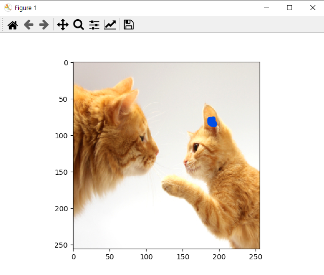

# SimilarityChecker
 Get similarity map or score using cosine similarity


## Example
Click ear of cat from query image.


Then you can get similarity map from key image. Left image is real cosine similarity value, and right is heatmap image.


If you use same key image with query image, then you can get internal or self similarity map.


Or if your task is "numeric", then you can get direct similarity value.
```
1.jpg - 1.jpg :  0.2091
```
It means that internal or self similarity score of image *1.jpg* is 0.2091.


## Prerequisites
We used following components:
- PyTorch 1.6+
- torchvision 0.7+
- scikit-image
- PyYAML
- PIL
- numpy
- opencv-python
- matplotlib


## How to use 
Specify *'query_directory'* and *'key_directory'* from config.yaml file. If you use *'visualization'* task,
then also do *'result_directory'*. In case of 'visualization' task, directory must be image file. 
In contrast, in case of 'numeric' task, directory must be folder that contains images.
   
```
dataset:
  query_directory: './query.jpg'
  key_directory:  './key.jpg'

  result_directory: './result.jpg'   # for visualization result
```


Also specify *'task'* category. 'numeric' or 'visualization' are only available.

```
task: 'visualization'       # 'numeric' or 'visualization'
```


If you use pycharm, and use 'visualization' task, you must not use pycharm plot tool.

**File - settings - Tools - Python Scientific**

Release the check of *Show plots in tool window*


Then you can run *main.py*
```
python main.py
```